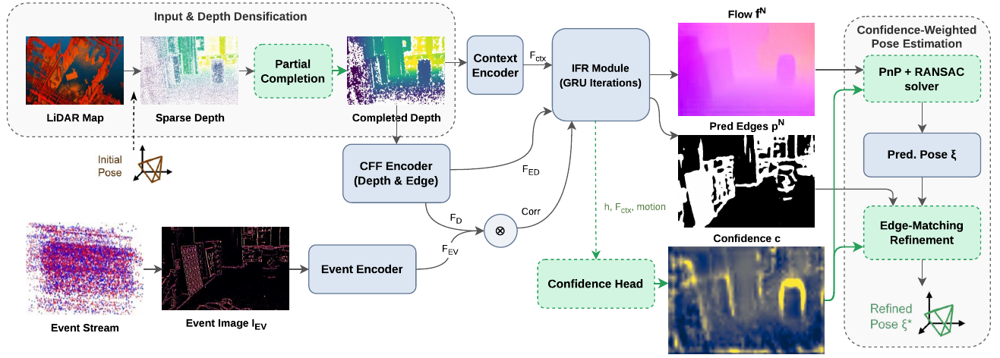
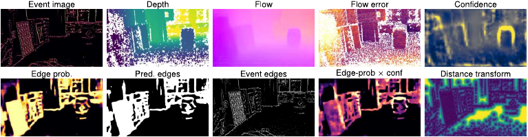

# CELL

**C**onfidence-weighted **E**vent camera **L**ocalization in **L**idar maps

CELL localizes an event camera inside a prior LiDAR map. It refines a coarse initial pose by predicting dense flow
between a depth image rendered from the map and an event image, turning the flow into 2D–3D correspondences, and
solving for the pose with PnP. It builds on [LEAR](https://arxiv.org/abs/2603.01839) (Chen et al., 2026) and adds a
**learned confidence for every correspondence**, supervised through the camera pose rather than through the
correspondence's own flow error.

## Demo

- [CELL (ours) vs. LEAR — indoor flight localization](https://www.youtube.com/watch?v=AB1O2NaSUgo)
- [Trajectory on a forest-driving sequence](https://www.youtube.com/watch?v=KvoStuKL47E)

## Why a pose-supervised confidence

The natural way to learn how reliable a correspondence is — supervising it on its own flow error — is biased in this
setting: small pixel errors sit mostly at large depths, where a correspondence barely constrains the camera
translation. A head trained that way ranks the flow error well and still makes the pose worse. CELL instead learns the
confidence end to end *through the pose*, with a differentiable probabilistic PnP layer (EPro-PnP) whose log-partition
term favours weights that give a well-constrained pose distribution.



## Contributions

- **A pose-supervised correspondence confidence**, learned through a differentiable probabilistic PnP, with a
  **decoupled training scheme**: the confidence reweights the flow supervision without letting pose gradients reach the
  flow/edge backbone.
- **Probabilistic correspondence selection at test time**: each correspondence is kept with a probability that grows
  with its normalized confidence (`floor0`), at no runtime cost.
- **Confidence-weighted edge-matching refinement**: the network's edge probability × the confidence weights a final
  2D–3D edge alignment.
- **Partial depth completion**: a strictly local, one-pixel completion of the rendered depth that adds correspondences
  without hallucinating depth across object boundaries.
- **An evaluation on 22 sequences of M3ED and DSEC**, with ablations of each component and a cost analysis. The complete
  system improves on the LEAR baseline on the majority of sequences, with median translation error reduced by up to
  26.9 % and median rotation error by up to 15.8 %.


*The learned confidence is not a copy of the flow error: it concentrates on near, high-parallax structure.*

---

## Installation

Tested with PyTorch 2.2.2 / CUDA 12.2, Python 3.10.

```bash
conda create -n cell python=3.10 -y
conda activate cell
pip install -r requirements.txt

# compiled extensions
cd core/correlation_package && python setup.py install && cd ../..
cd core/visibility_package  && python setup.py install && cd ../..
cd blender-mathutils        && python setup.py install && cd ..
```

Also compile [PoseLib](https://github.com/PoseLib/PoseLib) for the PnP solver. The event-frame preprocessing
(`tools/m3ed/event2frame.py`) additionally needs the
[Metavision SDK](https://docs.prophesee.ai/stable/installation/linux.html) filters — see *Data preparation*.

## Data preparation

CELL is evaluated on [M3ED](https://m3ed.io) (per-scene models) and [DSEC](https://dsec.ifi.uzh.ch) (one universal
model). For each pose, three inputs are needed: a **local LiDAR map**, an **event frame**, and the **ground-truth
pose**.

- **Event frames.** CELL uses the Metavision STC/Trail representation (`ours_denoise_stc_trail_pre_100000_half`), *not*
  an IWE. Generate them with `tools/m3ed/event2frame.py` (requires the Metavision SDK CV filters), or obtain
  pre-rendered frames from the dataset authors if you do not have an SDK license.
- **Local maps.** Generate per-frame local LiDAR maps with `tools/m3ed/generate_local_maps.py` (edit `M3ED_ROOT` /
  `OUTPUT_ROOT` at the top, or adapt to args). It crops the global cloud per pose into the event-camera frame and
  creates the `<seq>_data.h5` / `<seq>_pose_gt.h5` symlinks the dataloader expects.
- **Test perturbations.** The fixed test-time initial-pose perturbations (r = 5°, t = 0.5 m) are shipped in
  `test_set_init_pose/{M3ED,DSEC}/test_RT_seq_<seq>_5.00_0.50.csv`. Pass one with `--test_rt`, or copy it to the data
  root as `data/<dataset>/test_RT_seq_<seq>_5.00_0.50.csv` (the loader's default path).

Expected data layout: `data/m3ed/<seq>/{event_frames_<rep>/, local_maps/, <seq>_data.h5, <seq>_pose_gt.h5}`.

## Training

> **Note on the depth flag:** `--partial_depth partial_light` *is* the paper's "partial depth completion"
> (one 3×3-cross dilation + median/bilateral smoothing, no morphological close, no large-gap fill; ~20→68% valid).
> The `partial` and `partial_dc` variants in the code are disabled exploratory options, not used in the paper.

Per-scene M3ED model (CELL recipe: partial depth completion + decoupled β1.5 confidence). The flow loss
is supervised on the completed partial-depth support (`--dense_flow`); the encoder input is unchanged:

```bash
python main.py --data_path data/m3ed --dataset m3ed \
  --ev_input ours_denoise_stc_trail_pre_100000_half \
  --test_sequence falcon_indoor_flight_3 --train_sequence falcon_indoor_flight_1,falcon_indoor_flight_2 \
  --partial_depth partial_light --dense_flow \
  --conf_head --pose_e2e --pose_e2e_decouple --pose_e2e_beta_pred 1.5 \
  --conf_feats net,cnet,motion --conf_kernel 1 --conf_nets 4 \
  --pose_e2e_weight 0.1 --pose_e2e_reg 20 --pose_e2e_npts 512 --pose_e2e_warmup 300 \
  --backbone edge --use_feature_fusion --gpus 0 --lr 4e-5 --wdecay 5e-5 \
  --epochs 100 --evaluate_interval 5
```

DSEC trains a single universal model on all training sequences with **sparse** depth (no `--partial_depth`) and
`--ev_input ours_pre_100000`. Use `best_model.pth` (min validation pose loss), not the last epoch.

## Evaluation

```bash
python eval_full.py --ckpt <best_model.pth> --seq <seq> --dataset m3ed \
  --partial_depth partial_light \
  --test_rt test_set_init_pose/M3ED/test_RT_seq_<seq>_5.00_0.50.csv \
  --pweight_floors 0,0.5 --dump out.npz
```

Reports, per selection rule (`all` / `floor0` / `floor0.5` / `>median`): median/mean translation (cm) and rotation
(°), accuracy, and flow EPE. **CELL's deployed rule is `floor0`.** (DSEC: drop `--partial_depth`, use the sparse
model.)

## Confidence-weighted edge-matching refinement

Optional. Selection (`floor0`) already accounts for most of the gain; refinement is a small, regime-dependent
add-on. It runs a single config — 6-DOF alignment, trust-region anchor 300, edges weighted by edge-probability ×
confidence (a safe setting that does not hurt):

```bash
python tools/pose_refine/eval_refine.py --seq <seq> --dataset m3ed \
  --load_checkpoints <best_model.pth> --partial_depth partial_light \
  --test_rt test_set_init_pose/M3ED/test_RT_seq_<seq>_5.00_0.50.csv \
  --iters 24 --init_poses out.npz --select floor0 \
  --edge_conf weight --edge_conf_src both --anchor_w 300 --out refine_<seq>.csv
```

(For analysis, `--sweep_both --out_prefix refine_<seq>` instead runs the full {full, translation-only} ×
anchor-{10,30,300} grid.)

## Runtime / memory

```bash
python bench_runtime.py --ckpt <best_model.pth> --seq falcon_indoor_flight_3
```

## Acknowledgements

CELL builds directly on **LEAR** (Chen et al., *Learning Edge-Aware Representations for Event-to-LiDAR Localization*,
2026) and vendors the **EPro-PnP** differentiable PnP layer (Chen et al., CVPR 2022, MIT — see
`core/epropnp/LICENSE`). It also uses **PoseLib** for the PnP solver. The flow/edge backbone is LEAR's. Please cite
LEAR and EPro-PnP alongside CELL.

## License

Released under the **MIT License** (see `LICENSE`). Vendored third-party components keep their own licenses
(`core/epropnp/LICENSE`, MIT).

## Status

This repository contains the training, evaluation, and confidence-weighted refinement code, together with the scripts
and the shipped test perturbations needed to reproduce the results.

## Paper and thesis

- **Paper:** *Learning Which Correspondences to Trust: Confidence-Weighted Event-Camera Localization in LiDAR Maps.* [arXiv:2610.11967](https://arxiv.org/abs/2610.11967)
- **Thesis:** diploma thesis, Department of Electrical and Computer Engineering, University of Patras. [hdl.handle.net/10889/32879](https://hdl.handle.net/10889/32879)

## Author

Panagiotis Kiousis — Department of Electrical and Computer Engineering, University of Patras.
